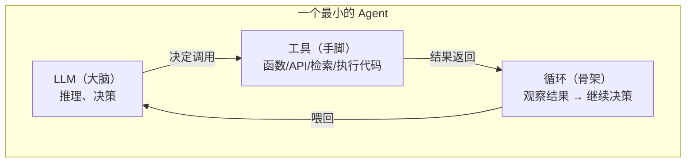
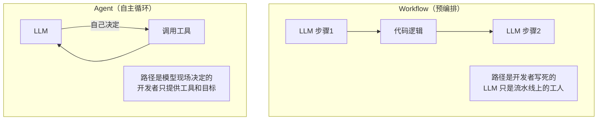
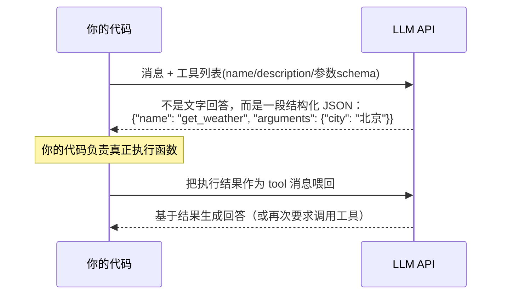
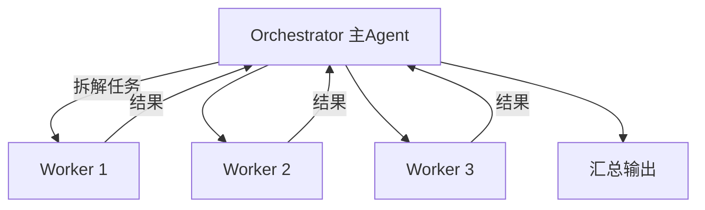

# 阶段一：理解本质

> 预计 1~2 周。目标：不写代码，先把 Agent 的心智模型建立正确。

## 1. Agent 的定义

> **Agent = 在循环中使用工具、并根据观察结果自主决定下一步的 LLM。**

拆开看只有三个组件：



## 2. Workflow vs Agent（最重要的区分）



| | Workflow | Agent |
|---|---|---|
| 控制流 | 代码写死 | 模型决定 |
| 可预测性 | 高 | 低 |
| 成本 | 低（调用少） | 高（多轮循环） |
| 适用场景 | 任务路径可枚举 | 任务路径无法预知 |

**核心结论（来自 Anthropic）：能用 Workflow 解决的问题，不要上 Agent。** 从最简单的方案开始，只有在确实需要灵活性时才增加复杂度。

## 3. Function Calling 的底层机制（破除幻觉的关键）

模型**并不会执行任何函数**。真实发生的事情：



理解了这一点，"Agent 框架"的神秘感就消失了一半：框架做的事情本质上就是维护这个消息列表、解析 JSON、执行函数、循环。

## 4. ReAct：经典的推理-行动模式

论文 [ReAct: Synergizing Reasoning and Acting in Language Models](https://arxiv.org/abs/2210.03629)（2022，Google）提出的模式，至今仍是绝大多数 Agent 的骨架：

```
Thought:  我需要先查一下北京的天气
Action:   get_weather(city="北京")
Observation: 晴，25°C
Thought:  天气不错，用户说要户外活动，我推荐……
Answer:   今天适合户外活动……
```

在 Function Calling 出现之前，ReAct 靠纯文本提示实现（模型输出特定格式文本，代码用正则解析）。现在工具调用原生支持了，但"思考→行动→观察"的循环思想完全一致。

## 5. Agent 的其他常见模式（先混个脸熟）

- **Reflection（反思）**：模型对自己产出的结果自我批评并改进
- **Routing（路由）**：先分类，再分发给不同的处理分支
- **Orchestrator-Workers**：一个主 Agent 把任务拆解，分发给子 Agent 并行处理，最后汇总
- **Evaluator-Optimizer**：一个 Agent 生成，另一个 Agent 评审，循环迭代



## 必读资料

| 资料 | 说明 |
|------|------|
| [Anthropic《Building Effective Agents》](https://www.anthropic.com/engineering/building-effective-agents) | 本阶段最重要的文章，Workflow/Agent 区分和各种模式都出自这里 |
| [OpenAI《A Practical Guide to Building Agents》](https://cdn.openai.com/business-guides-and-resources/a-practical-guide-to-building-agents.pdf) | 偏产品视角的补充阅读 |
| [ReAct 论文](https://arxiv.org/abs/2210.03629) | 只需要精读第 2 节和图 1 |

## 动手练习（不写代码）

1. 用 ZCode / Claude Code 干一件多步骤的事（比如"帮我把这个文件夹里所有 md 文件的标题提取出来汇总"），观察它调用了哪些工具、调用了几轮
2. 写一篇 300 字的笔记，用自己的话解释：为什么"工具调用"是模型输出 JSON 而不是模型执行函数？这个设计为什么聪明？

## 验收标准

- [ ] 能画出 Agent 循环的图并解释每个环节
- [ ] 能说清 Workflow 和 Agent 的取舍
- [ ] 能解释 Function Calling 的真实机制
