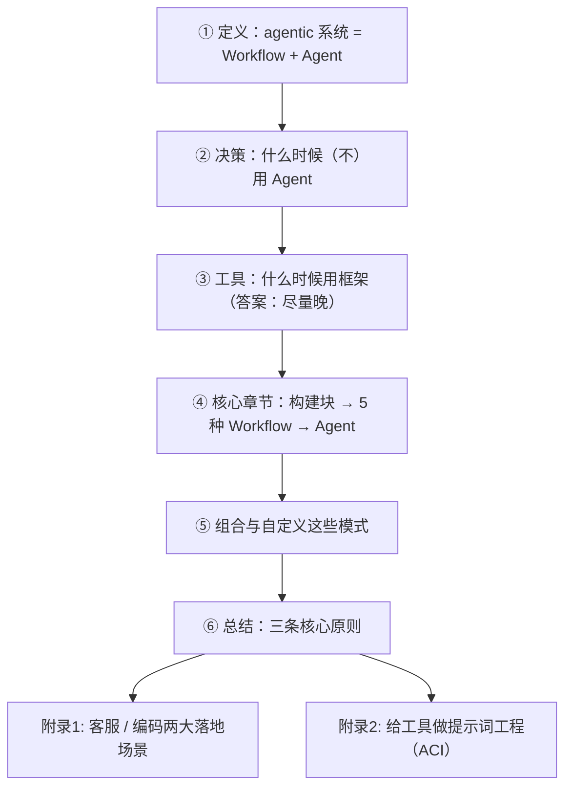
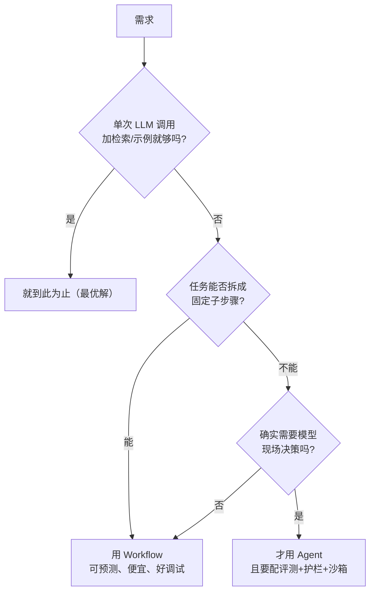
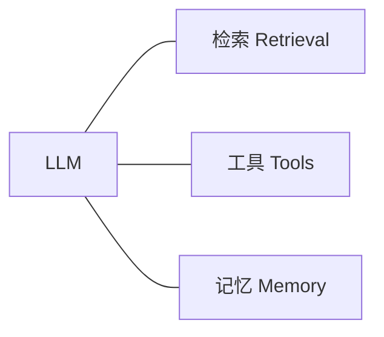
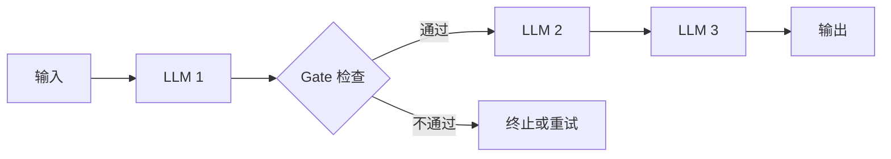
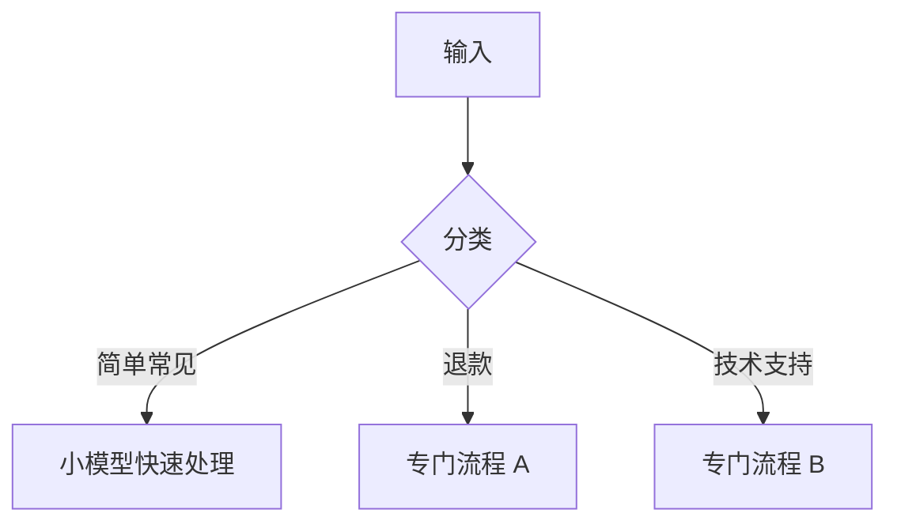
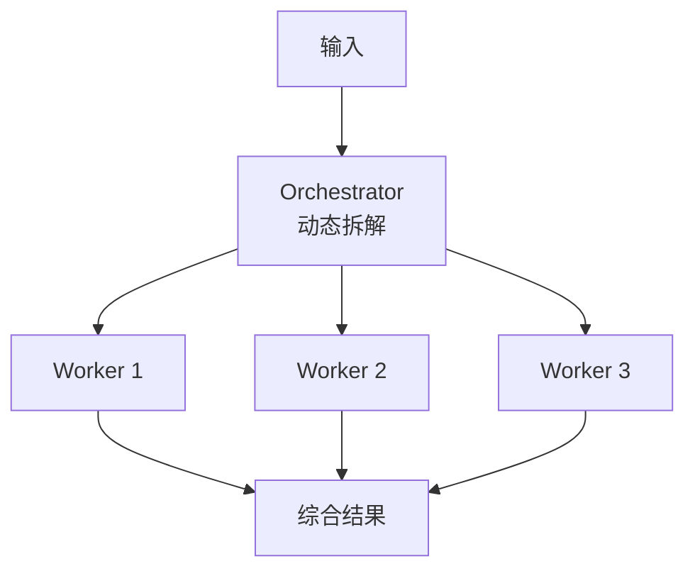
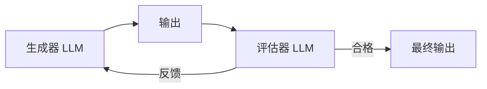
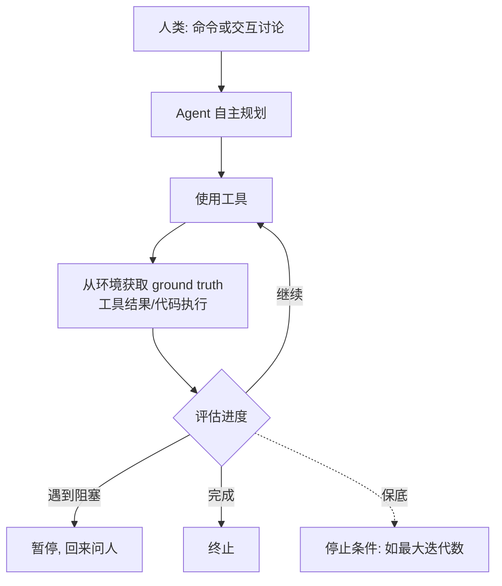
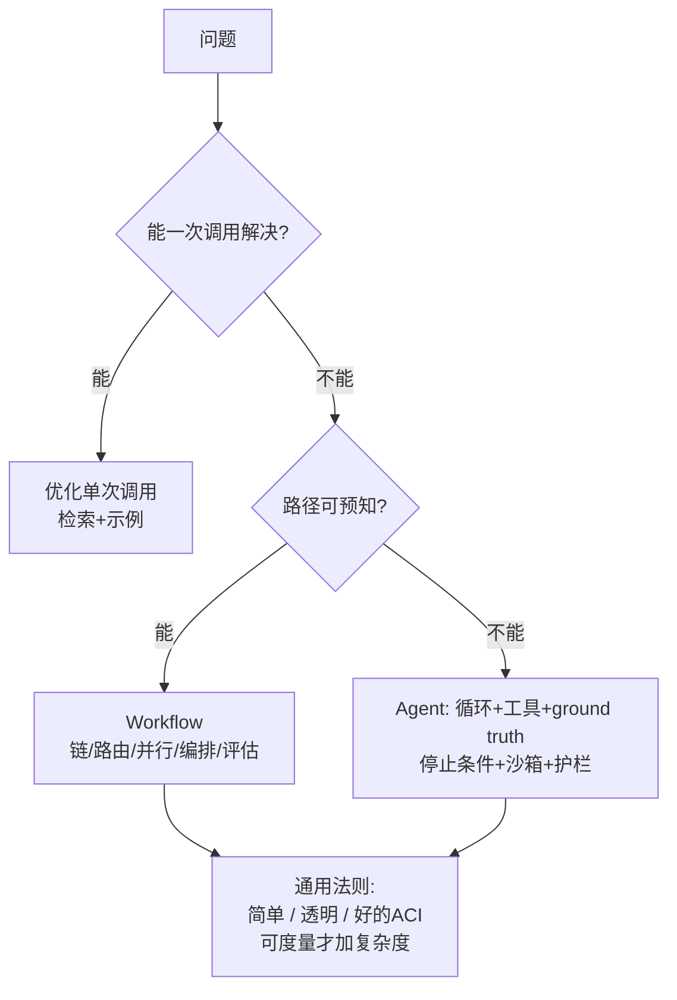

# 精读笔记：Building Effective Agents

> 原文：[Building_Effective_Agents_Anthropic.md](../papers/Building_Effective_Agents_Anthropic.md)（建议对照原文读）
> 本笔记 = 结构拆解 + 逐节讲解 + 自测题。作者 Erik slavakov（prompt eng）与 Barry Zhang（agent eng），2024-12。

---

## 0. 一句话总结

> **成功的 Agent 系统用的是简单、可组合的模式，而不是复杂框架；先用最简单的方案，只有可度量的收益才增加复杂度。**

整篇文章的一切内容都是这句话的展开。读完后你应该能用 30 秒把这句话讲给别人听。

## 1. 文章结构地图

写作逻辑是**复杂度递增**：先给一个基础积木（augmented LLM），然后五段式工作流逐个加复杂度，最后才是完全自主的 Agent。这个排列本身就体现了文章的主张。

---

## 2. 逐节拆解

### 2.1 定义：Workflow vs Agent（全文最重要的一张牌）

Anthropic 把两者统称 **agentic systems**，但做了严格的架构区分：

| | Workflow | Agent |
|---|---|---|
| 控制流 | **开发者**预定义代码路径 | **LLM** 动态决定自己的流程和工具使用 |
| 比喻 | 流水线上的工人 | 接到目标自己找路的员工 |
| 成本/延迟 | 低 | 高（多轮循环） |
| 可预测性/可防御性 | 高，出错好排查 | 低，错误会复合 |
| 适用 | 任务路径可枚举 | 任务路径无法预知 |

**为什么这个区分重要**：90% 的"要不要上 Agent"争论，本质是没分清自己要的其实是 Workflow。你接下来所有的架构决策都从这里开始。

**易错点**：很多人把"用了 LLM 的系统"都叫 Agent。判别标准只有一条——**控制流在谁手里**。在代码里 → Workflow；在模型手里 → Agent。

### 2.2 什么时候（不）用 Agent

原文的决策逻辑可以画成流程：

关键洞察：**Agent 是用延迟和成本换任务表现**。原文原话——"This might mean not building agentic systems at all."（这可能意味着根本不建 Agent 系统。）

**自测**：下面哪些该用 Agent？① 固定格式的客服工单分类 ② "帮我调研并写一份竞品报告" ③ 文档翻译后润色 ④ 排查一个无法预知原因的线上 bug。
（答案：①③② 都是 Workflow——分别是 routing / prompt chaining+evaluator；④ 无法预知步骤，是 Agent 的主场。）

### 2.3 什么时候用框架

原文立场非常鲜明：

- 框架简化了低级任务（调 API、解析工具、串联调用），✅ 入门快
- 但代价：① 抽象层遮住了底层的 prompt 和响应，**难调试**；② 诱使你把简单事情做复杂
- 建议：**直接用 LLM API 起步**；若用框架，必须读懂它底下的代码

这正是本学习路线"阶段二徒手写"的出处。原文还给了 cookbook 链接，可以之后对照。

### 2.4 核心章节：一块积木 + 五种 Workflow + Agent

**基础积木：The Augmented LLM（增强型 LLM）**

一切模式的原子单位 = LLM + 三种增强：

两个要点：① 增强能力要**针对你的用例裁剪**，不是越多越好；② 要给模型一个**接口清晰、文档完善**的接入方式（原文点名 MCP）。注意原文的假设：**后文每种模式中的每次 LLM 调用，都默认具备这些增强**——它是所有图里那个 "LLM" 节点的实际含义。

**模式一：Prompt Chaining（提示词链）**

任务分解为固定步骤序列，每步输出是下步输入；可在中间加程序化的 **gate（闸门）** 检查。

- **本质**：拿延迟换准确率——每次调用只做一件更简单的事
- **判据**：任务能**干净地**分解成固定子任务
- 例子：生成营销文案→翻译；写大纲→检查大纲→按大纲写文档
- 讲解：gate 是这个模式最容易被忽略的精髓——中间检查让错误**早停**，而不是传到最后才失败

**模式二：Routing（路由）**

先分类，再把输入导向专门化的后续处理。

- **本质**：关注点分离。不路由的话，为一种输入做的优化会伤害其他输入
- 例子：客服问题分流；简单问题给 Haiku、困难问题给 Sonnet（**模型分级**，这是省钱利器）

**模式三：Parallelization（并行化）**

两种变体要分清：

| 变体 | 做法 | 例子 |
|------|------|------|
| **Sectioning（切分）** | 一个任务拆成独立子任务并行跑 | 一个实例答问题，另一个同时审违规内容 |
| **Voting（投票）** | 同一任务跑多次 | 多个 prompt 各自查代码漏洞，多数决 |

- **本质**：要么提速，要么用多视角换高置信度
- 讲解：guardrails 用 sectioning 效果好于让同一个调用既干活又管安全——**一脑不能二用**，分开的注意力各自更专注

**模式四：Orchestrator-Workers（编排者-工作者）**

中心 LLM **动态**拆解任务→分发给 worker LLM→汇总结果。

- **与 Parallelization 的唯一区别**：子任务**不是预定义的**，是编排者根据输入现场决定的。图长得像，控制权的来源不同
- 例子：改多个文件的编码任务（改几个文件、各改什么，取决于任务本身）；多来源搜索
- **自测**：批量给 100 篇文章做摘要，每篇一个 LLM 调用——这是 Parallelization 还是 Orchestrator-Workers？（答：Parallelization。子任务在运行前就完全确定了。）

**模式五：Evaluator-Optimizer（评估者-优化者）**

一个 LLM 生成，另一个 LLM 评估给反馈，循环迭代。

- **适用判据（两个条件同时满足）**：① 有明确的评估标准；② 人类能通过给反馈改进产出，**且 LLM 也能给出这种反馈**
- 例子：文学翻译（译者/评者）；多轮搜索（评估者判断要不要继续搜）
- 讲解：注意第二个判据的巧妙之处——它借用了"人机反馈有效性"作为 LLM 反馈有效性的代理指标。如果人类给反馈都没用，别指望评估器有用

**终章：Agents**

先看原文的定义性描述（这段值得背下来）：

> "They are typically just **LLMs using tools based on environmental feedback in a loop**."（它们通常只是 LLM 在循环中基于环境反馈使用工具而已。）

关键点：
- **ground truth（环境真实反馈）** 是 Agent 和纯聊天的分水岭——每一步都要从环境拿真实信号来校准
- **人在环中**：checkpoint 时回来问人，遇到 blocker 也回来问人
- **必须有停止条件**（最大迭代数），这是控制成本和失控风险的最后防线
- 适用：开放式问题、无法预测步数、无法硬编码路径、且环境**可信**
- 代价：成本高 + **错误复合（compounding errors）**——所以要在沙箱里充分测试、配好护栏
- 例子：SWE-bench 编码 Agent；computer use

**自测**：Agent 循环里"环境反馈"解决了 LLM 的什么根本缺陷？（答：模型没有真实世界状态，只会生成看起来合理的文本；环境反馈把"合理"锚定为"真实"。）

### 2.5 组合与自定义

这些模式**不是处方**，是可以拼装的积木。真实系统往往是混合体：一次调用里可能既有 routing 又有 parallelization。唯一的硬规则回到全文主旨：**只有可度量的改进才配得上新增的复杂度**（"only when it demonstrably improves outcomes"）。

### 2.6 三条核心原则（总结）

1. **Simplicity**：设计保持简单
2. **Transparency**：显式展示 Agent 的规划步骤（可解释、可调试）
3. **ACI**：通过充分的工具文档和测试，精心打磨 Agent-计算机接口

---

## 3. 附录的精华（正文容易略过，工程上极重要）

### 附录 1：两大落地场景的共同特征

客服 Agent 和编码 Agent 之所以成功，共同点是：

- **对话 + 行动**结合
- **成功标准清晰**（工单解决 / 测试通过）
- **有天然的反馈闭环**（用户确认 / 测试结果）
- **人类监督可嵌入**（审查 / PR review）

**迁移思维**：你设计自己的 Agent 时，先检查这四条满足几条。一条都不满足的场景慎入。

### 附录 2：给工具做提示词工程（ACI）

这一节是全文工程含金量最高的部分，核心观点：**工具定义值得和系统提示词同等级别的投入**。

工具格式的三条原则：

1. 给模型足够的 token **先想后写**（避免把自己逼进死角）
2. 格式贴近模型在互联网文本里**见过的自然形态**（所以 diff 比 JSON 转义友好、markdown 里写代码比 JSON 里写代码省力）
3. 消除格式"开销"（数行数、字符串转义这类认知负担）

ACI 实操四条：

1. **换位思考**：只看描述和参数，你会用吗？需要犹豫的，模型也会错
2. **参数命名当作文档写**：想象给团队里最需要文档的初级工程师写 docstring
3. **实测**：跑大量输入，看模型怎么用错，迭代
4. **Poka-yoke（防呆设计）**：把参数设计成"想犯错都难"

点睛案例：SWE-bench Agent 中，Anthropic 花在**优化工具上的时间超过了总提示词**。相对路径出错 → 改成强制绝对路径 → 模型零错误。**改工具比改提示词有效**——这句话可以当作你阶段二调试的第一原则。

---

## 4. 全文浓缩成一页

## 5. 读后自测（全部答对再进阶段二）

1. Workflow 和 Agent 的判别标准是什么？（一句话）
2. 五种 Workflow 分别解决什么问题？各自的"适用判据"是什么？
3. Orchestrator-Workers 和 Parallelization 的本质区别？
4. 为什么 guardrails 要用 Parallelization 的 sectioning 而不是让一个调用兼任？
5. Agent 循环为什么需要 ground truth 和停止条件？
6. 附录 2 中"改工具比改提示词有效"的案例是什么？它对你设计工具有什么启发？
7. 评估者-优化者模式成立的两个条件是什么？

## 6. 和学习路线的衔接

- 本篇的五种模式 → 阶段四会用 LangGraph / Agents SDK 重新实现，到时候回来对照
- MCP 在文中被点名 → 阶段三主题
- ACI / 工具设计 → 项目 1 和项目 4 的核心功课
- 下一步：进入 [02-hands-on](../02-hands-on/README.md)，用代码把 "LLM using tools based on environmental feedback in a loop" 这句话变成真的
