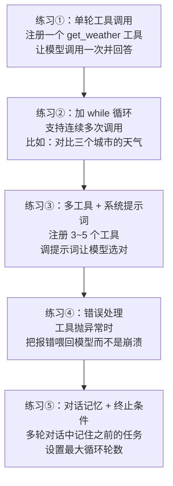

# 阶段二：徒手写一个最小 Agent ⭐

> 预计 1~2 周。**整个学习路线中最重要的一步。**
> 规则：不使用任何 Agent 框架，只用 LLM API 的 SDK（openai / anthropic / zhipuai 任选）。

## 为什么这一步最重要

框架的每一个"魔法"，在这个阶段都会变成你亲手写过的代码。之后看 LangGraph 时你会发现：它只是把你写过的循环换了一种组织方式。

## 动手清单



## 参考代码骨架（Python + 通用伪代码）

这是练习②的核心结构，建议先自己写，卡住了再对照：

```python
import json
from openai import OpenAI   # 或其他厂商 SDK，接口大同小异

client = OpenAI()

# 1. 工具就是普通的 Python 函数
def get_weather(city: str) -> str:
    # 真实场景调用外部 API；练习可以返回假数据
    return json.dumps({"city": city, "weather": "晴", "temp": "25°C"}, ensure_ascii=False)

TOOLS = [{
    "type": "function",
    "function": {
        # ★ description 是模型选工具的唯一依据，要写清楚"什么时候该用我"
        "name": "get_weather",
        "description": "查询指定城市的当前天气。当用户问到天气相关问题时使用。",
        "parameters": {
            "type": "object",
            "properties": {"city": {"type": "string", "description": "城市名，如：北京"}},
            "required": ["city"],
        },
    },
}]
TOOL_IMPLS = {"get_weather": get_weather}

# 2. Agent 循环
def run_agent(user_input: str, max_turns: int = 10) -> str:
    messages = [
        {"role": "system", "content": "你是一个乐于助人的助手，可以使用工具。"},
        {"role": "user", "content": user_input},
    ]
    for _ in range(max_turns):                     # ★ 终止条件，防止烧钱死循环
        resp = client.chat.completions.create(
            model="gpt-4o-mini",                   # 换成你用的模型
            messages=messages,
            tools=TOOLS,
        )
        msg = resp.choices[0].message
        messages.append(msg)

        if not msg.tool_calls:                     # 模型不再要工具 → 任务完成
            return msg.content

        for call in msg.tool_calls:                # 执行模型请求的每个工具
            fn = TOOL_IMPLS[call.function.name]
            args = json.loads(call.function.arguments)
            try:
                result = fn(**args)
            except Exception as e:
                result = f"工具执行出错: {e}"       # ★ 错误也是信息，喂回给模型
            messages.append({
                "role": "tool",
                "tool_call_id": call.id,
                "content": str(result),
            })
    return "达到最大轮数，任务未完成。"
```

## 这个阶段会踩的坑（踩过才有价值）

1. **模型不调用工具** → 99% 是工具描述写得太含糊，或者用户消息没有触发场景
2. **模型选错工具** → 检查各工具 description 是否有重叠歧义；参数 schema 是否清晰
3. **死循环烧钱** → 忘了 max_turns；或者工具结果没有正确喂回（`tool_call_id` 对不上）
4. **JSON 解析报错** → 模型偶尔生成不合法的参数，要有容错重试
5. **忘记把 assistant 的 tool_calls 消息 append 回去** → API 会报错，消息列表必须完整

## 延伸练习（学有余力）

- 加一个 `search_web` 工具（可以用 DuckDuckGo 的免费库 `ddgs`），做一个能"查资料再回答"的助手
- 把系统提示词改成一个"研究助理"人设，观察工具选择行为的变化
- 统计并打印每一轮的 token 消耗，直观感受 Agent 的成本结构

## 验收标准

- [ ] 不看任何教程，30 分钟内从空文件写出工具调用循环
- [ ] 能解释 messages 列表里每种角色（system / user / assistant / tool）的职责
- [ ] 有一个自己踩坑后修复的记录（写进笔记里）
