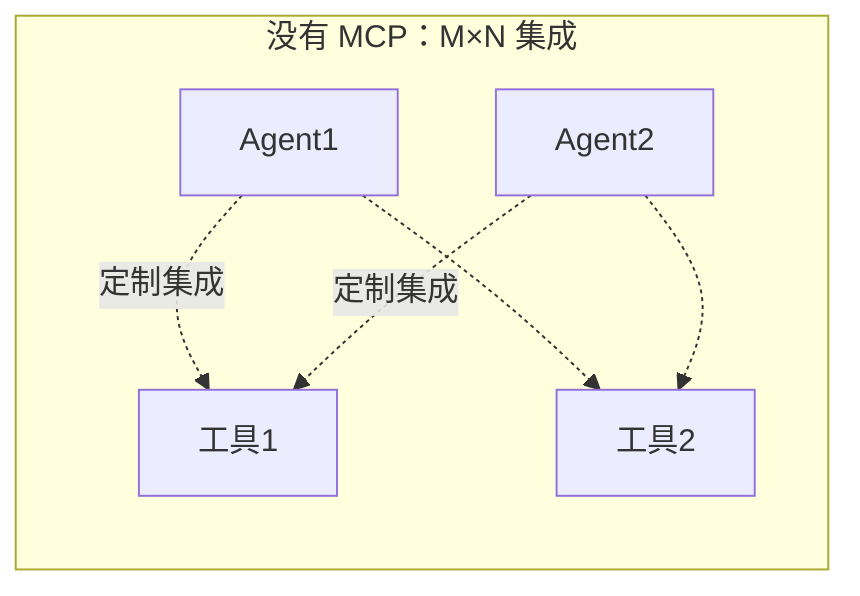
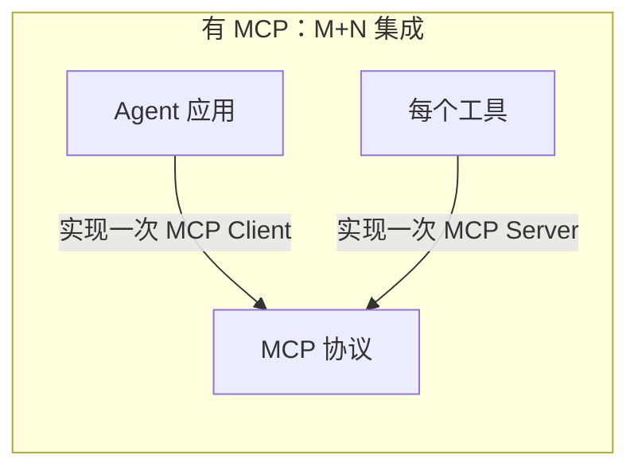
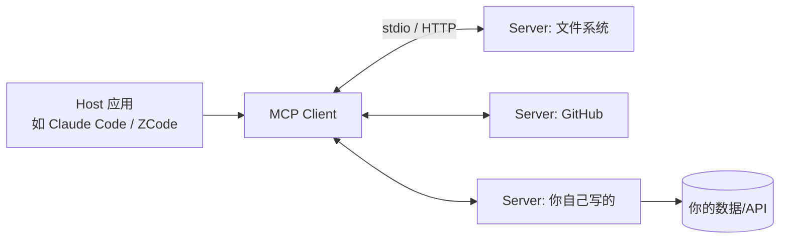
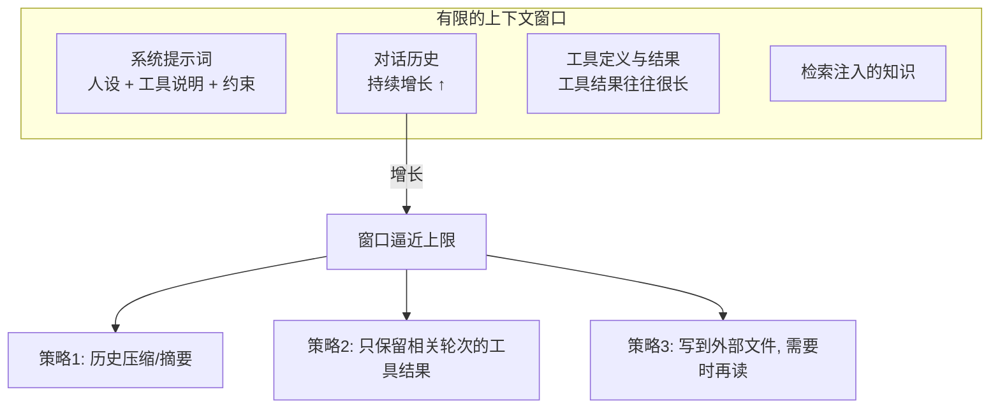
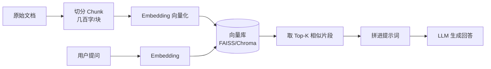
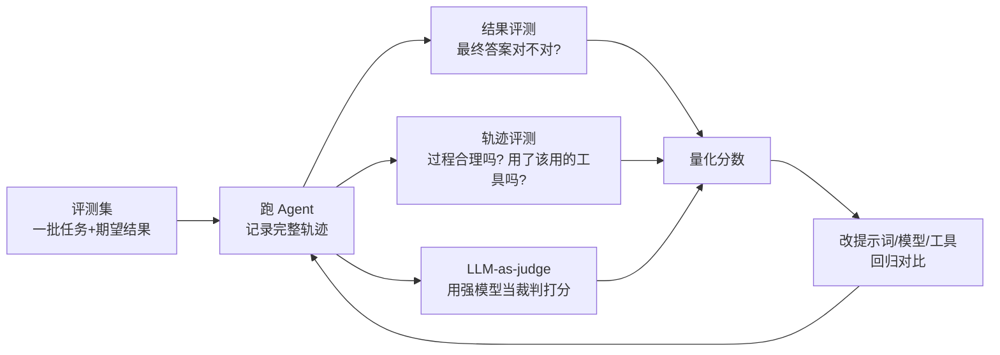

# 阶段三：补齐关键概念

> 预计 2~3 周。目标：掌握把玩具 Agent 变成可用产品的三块能力：**MCP、上下文工程、评测**。

## 一、MCP（Model Context Protocol）

### 解决什么问题

没有 MCP 时：M 个 Agent 应用 × N 个工具，需要 M×N 次定制集成。MCP 把它变成 M+N：

> 类比：MCP 之于工具，就像 USB 之于外设——定义了统一的插口标准。

### 架构

Server 暴露三类能力：
- **Tools**：模型可调用的函数（最常用）
- **Resources**：可读取的数据（文件内容、数据库记录）
- **Prompts**：预置的提示词模板

### 动手任务

1. 用官方 Python SDK（`pip install mcp`）写一个最简单的 MCP Server，暴露 2 个工具（比如查本地 Markdown 笔记列表、读指定笔记）
2. 在一个 MCP 客户端（Claude Desktop / Claude Code / ZCode）里配置并使用它
3. 思考：对比阶段二手写的工具调用，MCP 在哪一层做了标准化？

### 资料

- [MCP 官方文档](https://modelcontextprotocol.io) —— 从 Quickstart 开始
- [MCP Python SDK](https://github.com/modelcontextprotocol/python-sdk)
- [MCP 服务器示例合集](https://github.com/modelcontextprotocol/servers)

---

## 二、上下文工程（Context Engineering）

### 为什么它重要

提示词工程是"怎么问"，上下文工程是"每一轮循环时，窗口里应该有什么"。Agent 的失败案例中，大部分根源是上下文出了问题：该在的没在（遗忘）、不该在的占了地方（稀释注意力）、爆了窗口（截断错误）。

上下文的组成与流失：

### 三个核心策略

1. **压缩（Compaction）**：历史太长时，让模型把旧对话总结成摘要替换原文。参考 Claude Code 的 compact 机制
2. **结构化笔记（Scratchpad / 外部记忆）**：把中间结论写到文件里，需要时再读——Agent 版的"好记性不如烂笔头"
3. **检索注入（RAG）**：不把全部知识塞进窗口，而是按需检索最相关的片段

### RAG 基本流水线

最小可用组合：`openai embeddings` + `chromadb`，100 行以内可以跑通。

### 资料

- [Anthropic《Effective Context Engineering for AI Agents》](https://www.anthropic.com/engineering/effective-context-engineering-for-ai-agents) —— 本主题最重要的文章
- Anthropic《Building Effective Agents》中关于检索的部分

---

## 三、评测（Evals）

### 为什么它最难也最值钱

Agent 的行为是非确定性的、多步的。没有评测，每次改提示词/换模型/加工具都是在凭感觉赌博。工业界最缺的就是会做 Agent 评测的人。

### 入门实践

1. 给阶段二写的 Agent 建 10~20 个测试用例（输入 + 期望的工具调用序列或最终答案）
2. 每次修改后批量跑一遍，记录成功率——这就是最朴素的 eval
3. 进阶：让一个强模型按评分标准（rubric）给轨迹打分（LLM-as-judge）

### 资料

- [OpenAI Evals 框架](https://github.com/openai/evals)
- Anthropic Docs: [Evaluation](https://docs.anthropic.com/en/docs/test-and-evaluate) 部分

---

## 验收标准

- [ ] 写过至少一个自己的 MCP Server 并在真实客户端中使用
- [ ] 给自己的 Agent 实现过历史压缩或 RAG 注入
- [ ] 建立过包含 10+ 用例的评测脚本，改版后能跑出对比数字
