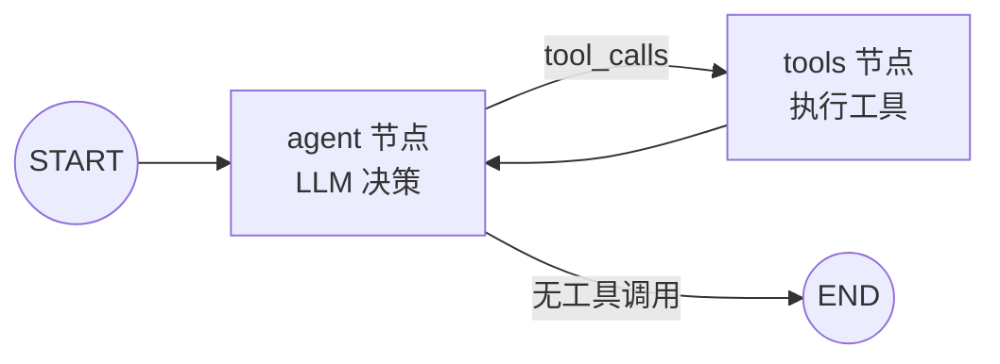
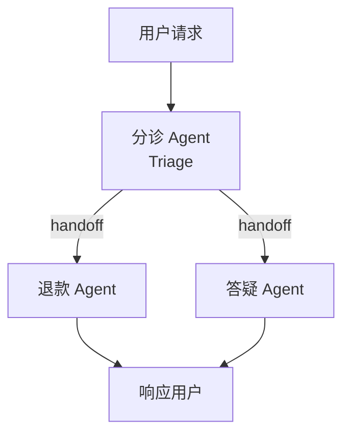

# 阶段四：框架原理与源码阅读

> 预计 2 周。前提：已完成阶段二。**带着"我手写过这个循环"的记忆去读，才能看出框架真正抽象掉了什么。**

## 心态与方法

框架解决的问题清单（你在阶段二都手工面对过）：

- 消息列表和工具的注册/解析 → 变成声明式定义
- Agent 循环 → 变成显式的**状态图**
- 错误重试、人工审批（human-in-the-loop）→ 变成内置节点
- 多轮/长任务的断点续跑 → 变成 **checkpoint / 持久化**
- 多 Agent 协作 → 变成 **handoff（交接）原语**

读源码时始终问：**"这一层抽象，对应我手写时的哪几行代码？它换来了什么、付出了什么？"**

## 一、LangGraph

LangGraph 是把 Agent 循环**显式建模为状态图**：节点是函数（LLM 调用、工具执行），边是控制流，状态在节点间流转。

重点看三个机制：

1. **StateGraph 与状态 schema**：状态（messages 等）如何定义和合并
2. **Checkpointing**：每步之后状态落盘，支持断点恢复和时间旅行——这是手写版很难做到的
3. **Human-in-the-loop**：在任意边前插入"人工审批"中断

资料：
- [LangGraph 官方文档](https://langchain-ai.github.io/langgraph/)，精读 Quickstart 和 "Why LangGraph?"
- [GitHub: langchain-ai/langgraph](https://github.com/langchain-ai/langgraph) —— 源码核心其实不大，可读

## 二、OpenAI Agents SDK

轻量级（对比 LangGraph 的重型图模型），核心原语只有三个：

| 原语 | 作用 |
|------|------|
| Agent | LLM + instructions + tools 的封装 |
| Handoff | 一个 Agent 把控制权**整个移交给**另一个 Agent |
| Guardrail | 在主循环外并行跑的输入/输出校验 |

重点体会 **Handoff vs 阶段一的 Orchestrator-Workers** 的区别：Handoff 是"移交控制权"（平行转接），Orchestrator 是"拆解-回收"（上下级）。

资料：
- [OpenAI Agents SDK 文档](https://openai.github.io/openai-agents-python/)
- 对照阅读 Anthropic 的观点：Anthropic 建议直接用 LLM API 起步，若用框架必须读懂底层代码（见《Building Effective Agents》"When and how to use frameworks" 一节，[精读笔记 §2.3](../01-fundamentals/notes-building-effective-agents.md) 有拆解）

## 三、读开源 Agent 源码（选一个深入）

### 推荐 1：12-factor agents（最推荐入门）
- [GitHub: humanlayer/12-factor-agents](https://github.com/humanlayer/12-factor-agents)
- 12 条构建可靠 Agent 的工程原则，每条都有"为什么"和反例。比如：
  - Factor 3: 把上下文窗口的所有权交给自己（Own your context window）
  - Factor 8: 简化你的 Agent（Agent 就是代码里的一个 for 循环，别神化它）
- 阅读成本最低，收益最高，**先读这个**

### 推荐 2：SWE-agent（学术严谨）
- [GitHub: SWE-agent/SWE-agent](https://github.com/SWE-agent/SWE-agent)
- 论文 [SWE-agent: Agent-Computer Interfaces](https://arxiv.org/abs/2405.15793) 提出 **Agent-Computer Interface (ACI)** 概念：为 Agent 设计工具就像为人设计 UI 一样重要——好用的工具（如带搜索的文件查看器）能显著提升成功率
- 在 SWE-bench 上验证过，工程实现干净

### 推荐 3：OpenHands（功能完整）
- [GitHub: All-Hands-AI/OpenHands](https://github.com/All-Hands-AI/OpenHands)
- 完整的通用软件工程 Agent，可以看事件流（Event Stream）架构、沙箱执行、浏览器/代码/终端多工具协作
- 代码量较大，适合按功能点去查而不是通读

## 常见框架速查（了解即可，不必都学）

| 框架 | 一句话定位 | 什么时候用它 |
|------|-----------|-------------|
| LangGraph | 显式状态图，功能最全 | 复杂多阶段工作流、需要 checkpoint |
| OpenAI Agents SDK | 轻量，handoff 优雅 | OpenAI 生态、多 Agent 转接 |
| CrewAI | 角色扮演式多 Agent | 快速原型多角色协作 |
| AutoGen (Microsoft) | 对话式多 Agent 研究框架 | 学术/实验 |
| Pydantic AI | 类型安全，工程感强 | Python 工程团队 |

## 动手任务

1. 用 LangGraph 重写阶段二的 Agent，对比代码量和可读性，写 200 字对比笔记
2. 用 OpenAI Agents SDK（或手写）实现一个双 Agent handoff：一个"前台"接到问题后转给"专家"
3. 从 SWE-agent 的角度审视自己在阶段二写的工具：哪个工具因为设计不好导致模型经常用错？重新设计它

## 验收标准

- [ ] 能说清 LangGraph 的图模型和手写循环的对应关系
- [ ] 能说清 Handoff 和 Orchestrator 的区别
- [ ] 读完 12-factor agents 并能复述其中至少 5 条原则
