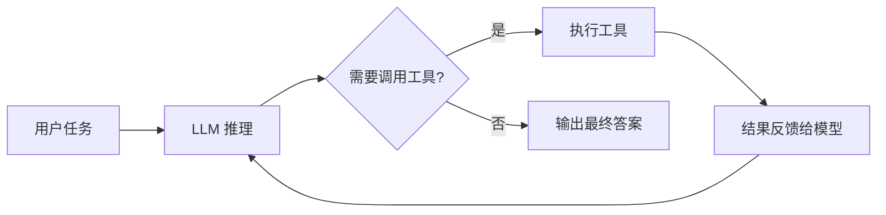
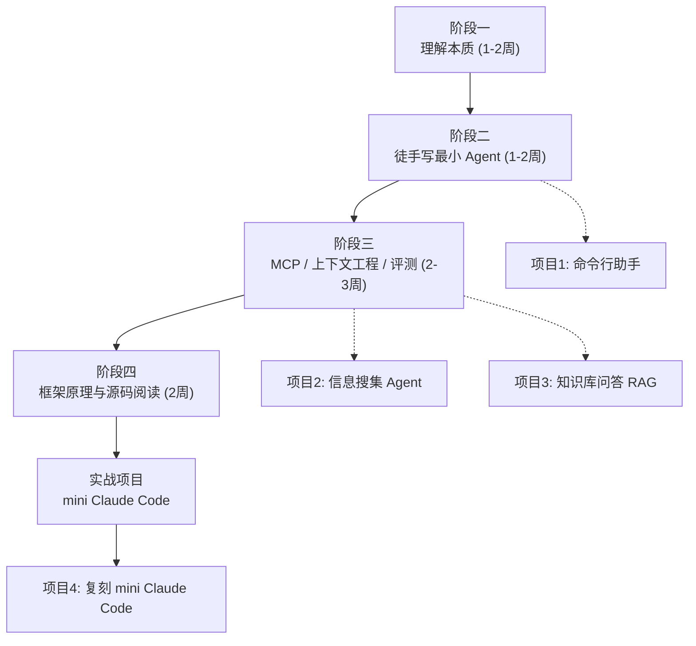

# Agent Learning

一个系统学习 **AI Agent** 的工程。目标不是收集资料，而是从第一性原理出发理解 Agent 的本质（LLM + 工具调用 + 反馈循环），最终能够独立设计和实现生产级 Agent。

## 这个工程是什么

Agent 并没有魔法。一个 Agent 的核心就是一个循环：



理解了这个循环，就理解了所有 Agent 框架（LangGraph、OpenAI Agents SDK……）在做的事情。本工程的内容都围绕这一点展开。

## 目录结构

```
agent-learning/
├── README.md               # 本文件：工程介绍与进度追踪
├── roadmap.md              # 学习路线总览（含 Mermaid 图）
├── resources.md            # 全部资料索引（论文 / 博客 / 课程 / 开源项目）
├── 01-fundamentals/        # 阶段一：理解本质 —— Agent 到底是什么
├── 02-hands-on/            # 阶段二：徒手写一个最小 Agent（最重要）
├── 03-concepts/            # 阶段三：补齐关键概念（MCP / 上下文工程 / 评测）
├── 04-frameworks/          # 阶段四：框架原理与源码阅读
├── papers/                 # 论文原文（含阅读顺序指南，见 papers/README.md）
└── projects/               # 边学边做的四个实战项目
```

每个阶段的目录下都有一个 `README.md`，包含：学习目标、核心笔记、关键资料、动手练习。

## 学习路线一览



核心原则：**先徒手写，再用框架；单 Agent 做好之前，不碰多 Agent。**

## 进度追踪

### 阶段

- [ ] 阶段一：理解本质
- [ ] 阶段二：徒手写最小 Agent
- [ ] 阶段三：MCP / 上下文工程 / 评测
- [ ] 阶段四：框架原理与源码阅读

### 论文精读（索引见 [papers/README.md](papers/README.md)）

- [x] Anthropic《Building Effective Agents》→ [笔记](01-fundamentals/notes-building-effective-agents.md)
- [x] ReAct → [笔记](papers/notes/notes-ReAct.md)
- [x] OpenAI《Practical Guide》→ [笔记](papers/notes/notes-OpenAI-Guide.md)
- [x] Toolformer → [笔记](papers/notes/notes-Toolformer.md)
- [x] Reflexion → [笔记](papers/notes/notes-Reflexion.md)
- [x] Tree of Thoughts → [笔记](papers/notes/notes-Tree-of-Thoughts.md)
- [x] SWE-agent / ACI → [笔记](papers/notes/notes-SWE-agent-ACI.md)

### 项目

- [ ] 项目 1：命令行文件助手
- [ ] 项目 2：网页信息搜集 Agent
- [ ] 项目 3：个人知识库问答
- [ ] 项目 4：复刻 mini Claude Code

## 如何使用这个工程

1. 按 `roadmap.md` 的顺序推进，每完成一个阶段就在上面打勾
2. 阶段笔记写在各阶段目录里，论文精读笔记统一写在 `papers/notes/`（并在 [papers/README.md](papers/README.md) 登记索引），代码写在 `projects/` 对应项目下
3. 学到新东西优先问自己："它在那个循环里的哪一步？"——所有设计都可以映射回核心循环
