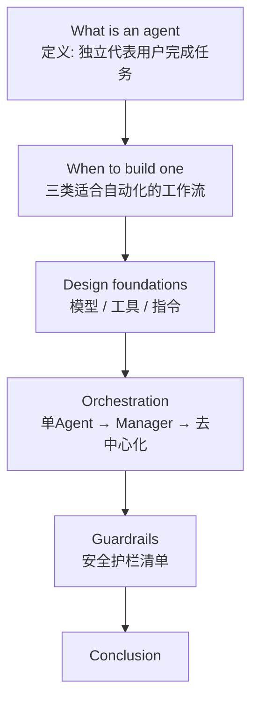
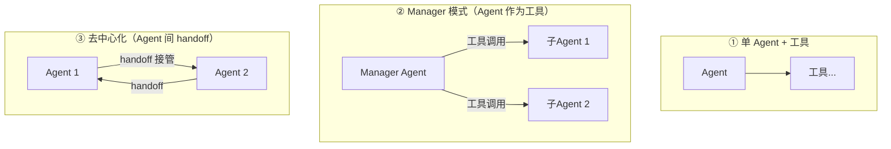

# 精读笔记：A Practical Guide to Building Agents（OpenAI）

> 原文：[OpenAI_A_Practical_Guide_to_Building_Agents.pdf](../OpenAI_A_Practical_Guide_to_Building_Agents.pdf)（2025-01，OpenAI，34 页小册子）
> 定位：写给**产品和工程团队**的第一本 Agent 实操手册。与 Anthropic 那篇对照读收获最大。

## 0. 一句话总结

> **Agent = 独立替你完成任务的系统 = 模型（决策）+ 工具（行动）+ 指令（约束），编排上先榨干单 Agent 能力，护栏必须从第一天就建。**

## 1. 结构地图

## 2. 逐节拆解

### 2.1 定义：和 Anthropic 版本对照

OpenAI 给的判别标准更"产品化"。Agent 的两个核心特征：

1. **用 LLM 管理工作流的执行与决策**：知道任务何时完成、能主动纠错、失败时能停下来把控制权交还用户
2. **能访问工具，且根据工作流当前状态动态选择工具**——但始终在明确界定的护栏内运行

明确排除项：聊天机器人、单轮 LLM、情感分类器——**不控制工作流执行的都不是 Agent**。

> 对照笔记：Anthropic 用 Workflow/Agent 二分法，OpenAI 直接给出"是不是 Agent"的判定特征。两家的刀法不同，切出来的边界基本重合：**控制流在模型手里 + 有工具 + 有护栏**。

### 2.2 什么时候该建 Agent

判据是"**传统自动化在这里失败过**"的工作流，三类信号：

1. **复杂决策**：需要细致判断、处理例外、看上下文（退款审批）。原文的比喻很传神：传统规则引擎像**核对清单**，LLM Agent 像**老练的调查员**——能看出"没违反任何一条规则但很可疑"的模式（支付欺诈分析案例）
2. **规则难以维护**：规则表庞大到更新成本高、易出错（供应商安全审查）
3. **重度依赖非结构化数据**：理解自然语言、从文档提取含义（家庭保险理赔）

**反向提醒（原文同样强调）**：这三条不满足就用确定性方案。两家公司在"能不上就不上"这一点上完全一致。

### 2.3 设计基础：三组件

| 组件 | 要点 |
|------|------|
| **Model** | 按"任务复杂度 / 延迟 / 成本"选型，先从能力够用的主力模型开始，必要时再混搭小模型 |
| **Tools** | 按三层组织：数据获取（查库/查文档/RAG）→ 领域行动（发退款/改工单）→ 编排工具（跨系统通信）|
| **Instructions** | 来源多样的经验汇总：每个工具的定义和边界、状态机式的步骤约束、异常处理规则、输出格式、拒绝话术 |

其中指令部分 OpenAI 叫它为模型**"认知工程"**——本质就是 Anthropic 说的提示词工程 + 工具文档，殊途同归。

### 2.4 编排（Orchestration）——本指南最大的增量贡献

两个原则先行：

- **先最大化单 Agent 能力**：加工具比加 Agent 便宜；"更多 Agent"通常是复杂度失控的开始
- **一切编排都是"run"**：一个循环——收集上下文 → 行动 → 验证 → 重复，直到完成或交还人类

三种模式：

- **单 Agent**：默认答案。够用就停在这里
- **Manager 模式**：中心管理器把子 Agent 当工具调用，自己掌握控制权（对应 Anthropic 的 Orchestrator-Workers）
- **去中心化**：Agent 之间**移交控制权**（handoff），没有中央控制器（对应 Anthropic 文章里没有单独强调、而 OpenAI Agents SDK 原生化了的原语）

建模视角：多 Agent 系统 = 图，Agent 是节点；Manager 模式的边是工具调用，去中心化的边是 handoff。

### 2.5 护栏（Guardrails）

篇幅最大的一章（约 8 页），核心思想：**护栏是 Agent 的一部分，不是事后补丁**。

- 分层防御：输入端（内容过滤、注入检测）、执行中（工具白名单、输出校验、人审节点）、输出端（幻觉/合规检查）
- 一个实用模式：**并行的安全检查 LLM**——一个实例干正事，另一个同时审输出是否合规（这就是 Anthropic 说的 Parallelization / Sectioning，只是叫法不同）
- 强调可观测：人类能随时看到 Agent 在干什么、随时接管

## 3. 两份指南对照总结（全文最值得带走的一张表）

| | Anthropic《Building Effective Agents》 | OpenAI《Practical Guide》 |
|---|---|---|
| 切入点 | 架构模式（从积木到 Agent） | 产品决策（该不该建、怎么护住） |
| 核心分类 | Workflow vs Agent 二分 | 单 Agent / Manager / 去中心化 |
| 编排态度 | "先最简单，模式可组合" | "先榨干单 Agent，再考虑多 Agent" |
| 对框架 | 明确建议少用 | 中性，顺带展示自家 Agents SDK |
| 独有贡献 | 五种 Workflow 模式 + ACI 理念 | 护栏清单 + 落地决策判据 |
| 一致结论 | **简单优先、可度量才加复杂度、工具定义值得最大投入** | 同左（表述不同） |

两家从不同出发点得到几乎相同的实践结论——这本身就是最强的信号。

## 4. 自测

1. OpenAI 判定"这是个 Agent"的两个核心特征是什么？哪些系统被明确排除？
2. 三种编排模式分别对应什么场景？Manager 模式和去中心化的本质区别？
3. 支付欺诈案例里"核对清单 vs 调查员"的比喻说明 Agent 的什么能力？
4. 两家指南在哪三点上结论完全一致？

→ 衔接：阶段四读 [OpenAI Agents SDK](https://openai.github.io/openai-agents-python/) 时，Manager 模式和 handoff 会变成你手写的代码。
