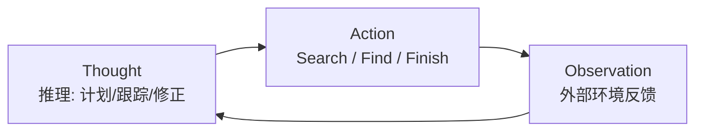

# 精读笔记：ReAct

> 原文：[ReAct_2210.03629.pdf](../ReAct_2210.03629.pdf)（ICLR 2023，Princeton + Google Brain）
> 作者包括 Shunyu Yao、Karthik Narasimhan——后来 Tree of Thoughts、SWE-agent 也是这个 Princeton 班底做的，三篇是一条思想线。
> **阅读策略：精读第 2 节（方法）和图 1，实验部分浏览即可。**

## 0. 一句话总结

> **把"推理"和"行动"交替进行：模型先想（Thought）再动手（Action），看结果（Observation）再想——这个循环让推理有据可依，让行动有章可循。**

## 1. 它解决什么问题

2022 年时有两派玩法，各有致命伤：

| 已有方法 | 做法 | 致命伤 |
|---------|------|--------|
| CoT（Chain-of-Thought） | 只推理不行动 | 没有外部信息来源 → **幻觉**、一个错步步错（error propagation） |
| Act-only | 只行动不推理 | 没有规划能力 → 盲目试错、不会处理异常 |

ReAct 的洞察来自人类的"内心独白"（inner speech）：人做事时，**想**和**做**本来就是交替的——"现在该烧水了"（跟踪进度）、"没盐了，用酱油代替"（处理异常）、"面团怎么发？上网查"（发现需要外部信息）。

## 2. 方法拆解

就是一条** Thought → Action → Observation 的交替轨迹**，用 few-shot 提示让模型模仿这个格式：

```
Question: 科学家发现 iPod 的发布日期前后，美国在位总统是谁？

Thought 1: 我需要先查 iPod 的发布日期
Action 1: Search[iPod]
Observation 1: iPod 是苹果公司 2001 年 10 月 23 日发布的便携式媒体播放器……
Thought 2: 2001 年 10 月 23 日，美国总统是乔治·布什……
Action 2: Finish[乔治·布什]
```



理解要点：

1. **Thought 有三种功能**（原文明确列出）：归纳/跟踪/更新行动计划、处理异常、发现需要外部信息的时机
2. **Action 是结构化的**（如 `Search[实体]`、`Find[段落]`），由外部代码解析执行——这就是今天 Function Calling 的前身，只不过当时靠正则解析纯文本
3. **Observation 是环境的真实反馈**（Wikipedia API 返回内容），不是模型编的

## 3. 关键实验结果

四个任务、两类性质：知识类（HotpotQA 多跳问答、Fever 事实核查）+ 交互决策类（ALFWorld 文字游戏、WebShop 网页购物）。

- 知识类：ReAct **显著减少幻觉和错误传播**，且轨迹人类可读可检查；和 CoT-SC 结合达到最好效果（推理和检索互补）
- 决策类：只用 1~2 个 in-context 示例，成功率分别比模仿学习/强化学习基线**绝对提升 34%（ALFWorld）和 10%（WebShop）**
- 附加发现：小模型上把 ReAct 格式拿来**微调**（fine-tune）比纯提示更好——提示的格式可以蒸馏成能力

## 4. 批判性视角（比结论更重要）

1. **提示格式本身已过时**：今天的模型原生支持 Function Calling，不需要再教模型输出 `Thought/Action` 文本格式。但**循环结构没有过时**——现代 Agent 就是"把 Thought 变成模型的内部推理、把 Action 变成结构化 tool call"的 ReAct。你手写 Agent 时写的就是它
2. **论文没解决错误恢复**：Observation 误导时会顺着错下去，这正是后来 Reflexion 要解决的问题（见 [notes-Reflexion.md](notes-Reflexion.md)）
3. **"隐性 Thought"的回归**：现在的推理模型（o1/o3、GLM 思考模式）把 Thought 内化成了模型能力，外部循环里只剩 Action/Observation——但原理同源

## 5. 对写 Agent 的三个直接启发

1. 系统提示词里鼓励模型"先想再调工具"——行动前的推理能显著降低选错工具率
2. Observation 要**精简、相关**（原文用 Wikipedia API 只返回相关段落）——这就是上下文工程
3. 轨迹可读性是免费的可解释性：调试时把 Thought-Action-Observation 打印出来，问题一目了然

## 6. 自测

1. CoT 和 Act-only 各自的失败模式是什么？ReAct 如何同时缓解？
2. Thought 在循环里承担哪三种功能？
3. 2022 年的 ReAct 和今天的 Function Calling，什么变了、什么没变？

→ 下一篇衔接：[Reflexion](notes-Reflexion.md)（ReAct 会犯错，怎么让它从错误中学习）
