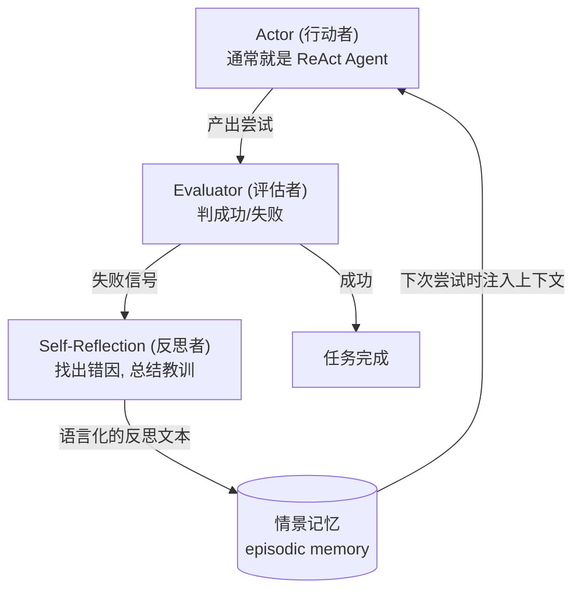

# 精读笔记：Reflexion

> 原文：[Reflexion_2303.11366.pdf](../Reflexion_2303.11366.pdf)（2023，Northeastern + Princeton）
> **选读论文。读摘要 + 图 1 + 图 2（架构）即可。作者 Noah Shinn 的同名开源仓库（noahshinn/reflexion）是阶段四推荐的源码阅读对象。**

## 0. 一句话总结

> **不用更新模型权重，而是让 Agent 把失败经历"说出来"（语言化反思），存进记忆，下次尝试时带上——用文字代替强化学习的梯度。**

## 1. 它解决什么问题

Agent 会失败（ReAct 会顺着错误走下去）。传统 RL 的解法是用奖励信号微调权重，但：要海量训练样本、要昂贵的微调、一个任务学到的不会迁移。而人类怎么从失败中学习？**复盘**。Reflexion 把"复盘"做成了 Agent 的机制。

## 2. 方法拆解

三个角色 + 一块记忆：

- **Actor**：干活的主力，通常直接复用 ReAct
- **Evaluator**：判断这次成没成。三种信号来源（原文并列）：环境二值反馈、启发式规则、**自我评估**（LLM 自判 / 自己写的单元测试跑通没）
- **Self-Reflection**：全文的精髓。把"失败"放大成"具体哪里错、下次怎么办"的语言化总结。原文称之为 **"semantic gradient"（语义梯度）**——给模型一个具体的改进方向，就像梯度给网络一个更新方向
- **记忆**：反思文本存入 episodic memory buffer，下次尝试时作为额外上下文注入。注意是**文字记忆，不是权重更新**——所以零微调、成本极低、可即时添加

## 3. 关键结果

- **HumanEval 编码基准 pass@1 = 91%，超过当时的 GPT-4 (80%)**——靠的不是更强的模型，而是"失败 → 反思 → 重试"的循环
- 在序列决策（ALFWorld）、推理、编码三类任务上全面超越无反思基线
- 消融实验的关键发现：**反思文本的质量直接决定提升幅度**；记忆的长度和具体性有影响

## 4. 批判性视角

1. **评估者是瓶颈**：反思的质量上限由评估信号决定——如果单元测试覆盖不住 bug，Agent 会"复盘出一个错误的教训"。这也是为什么编码任务最适合 Reflexion（测试天然是硬评估）
2. **记忆会膨胀、教训会重复**：多次失败后反思文本堆积，需要去重和压缩——这正是阶段三"上下文工程"里的历史压缩问题
3. **同一任务内的学习**：Reflexion 学到的东西只服务当前任务的重试，不是跨任务的长期学习。别和"持续记忆的 Agent"混为一谈

## 5. 对写 Agent 的启发

1. 阶段二练习④的进阶版：工具报错后，别只把报错喂回去，**让模型先写一句"上次为什么失败"再重试**——一个 20 行代码的 mini-Reflexion
2. "评估信号 → 语言化" 这个转化模式适用极广：评测阶段的 LLM-as-judge 打分（阶段三）就是 Reflexion 思想的应用
3. 复盘文本是最好用的调试素材：Agent 连续失败时，读它的反思链比读原始轨迹快得多

## 6. 自测

1. Reflexion 的三个角色各是什么？"语义梯度"是什么意思？
2. 为什么说编码任务是 Reflexion 最适合的场景？
3. Reflexion 和 RL 微调的取舍是什么？（成本 / 反馈粒度 / 迁移性）
