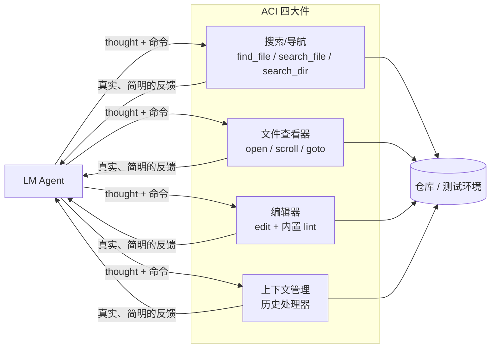

# 精读笔记：SWE-agent 与 Agent-Computer Interface (ACI)

> 原文：[SWE-agent_ACI_2405.15793.pdf](../SWE-agent_ACI_2405.15793.pdf)（NeurIPS 2024，Princeton NLP）
> **阶段四精读，做项目 4（mini Claude Code）之前必须读。** 正文（约 20 页）足够，超长附录按需查。
> 作者 John Yang、Carlos Jimenez 等，与 ReAct/ToT 同属 Princeton 班底——这条线值得记住。

## 0. 一句话总结

> **为 LM Agent 设计工具接口，要像 HCI（人机交互）为人类设计 UI 一样认真——一个精心设计的 ACI 能让不改模型权重的 Agent 性能翻数倍。**

## 1. 它解决什么问题

给 Agent 一台裸 Linux shell，它会挣扎：`sed`/`awk` 这类编辑命令难以正确使用，**改错了也不会收到任何反馈**。人类工程师有 VSCode 帮忙（语法高亮、lint、文件树），Agent 却在用比 1970 年代终端还原始的界面。

核心论断：**LM Agent 是一类新的"终端用户"，有自己的需求和弱点，值得为它专门设计接口。**

## 2. 方法拆解：SWE-agent 的 ACI 四大件

Agent 循环仍是 ReAct 式的（thought + command + feedback），创新全在**接口层**：

**四大件的设计细节（每一条都是踩坑后的对策，逐条品味）：**

1. **搜索/导航**：`find_file`（找文件名）、`search_file`/`search_dir`（找内容）。**搜索结果超过 50 条就不返回，而是提示"写一个更具体的查询"**——不是截断，是逼模型提高搜索质量
2. **文件查看器**：`open` + 100 行窗口 + 行号。窗口头部显示**文件全路径、总行数、前后各省略了多少行**——模型永远知道自己在哪、还剩多少没看
3. **编辑器**：`edit 起始行 结束行 新内容`，配合查看器使用。**内置 linter**：改完立刻检查语法，报错就**丢弃这次编辑**并把错误片段给模型让它重试——这是把 Building Effective Agents 里说的 Poka-yoke（防呆）做到了极致
4. **上下文管理**：最近 5 条 observation 之前的全部**折叠成一行**（保留计划和动作脉络、去掉过时的文件内容）；格式错误的输出触发报错重试，但**只保留第一次报错**，其余略去；命令无输出时明确回复"命令执行成功且无输出"（消除模型对"没输出是成功还是失败"的猜测）

### ACI 设计三原则（从细节中提炼，原文反复印证）

1. **动作空间小而简单**：少量精心设计的命令 > 无所不包的原始 shell
2. **每个动作都有具体、简明的反馈**：成功说什么、失败说什么、无输出也要说
3. **为模型的弱点做防呆**：lint 丢弃非法编辑、搜索过宽就拒答——把"容易犯的错"变成"犯不了的错"

## 3. 关键结果

| 指标 | 数字 |
|------|------|
| SWE-bench Full（2294 个真实 GitHub issue）解决率 | **12.47%**（此前非交互式 SOTA 仅 3.8%，6 倍以上提升） |
| HumanEvalFix pass@1 | 87.7% |
| 消融：ACI vs 裸 shell 基线（300 实例子集） | **+10.7 个百分点** |
| ACI 可移植性：换用 Claude 3 Opus | 仍达 10.5% |

消融实验最有价值的结论：**同一批任务、同一个模型，只换接口设计就有数量级差异**。模型能力不是瓶颈，接口才是。

## 4. 批判性视角

1. 数字已过时：12.47% 在 2024 年是 SOTA，如今榜单已到 70%+，**但结论反而更坚硬了**——历代 SWE-bench 顶尖系统的提升全部来自更好的 Agent 架构和工具设计，而非等新模型
2. ACI 是任务定制的：这套文件查看器/编辑器为 SWE 场景设计，换到浏览器/数据分析场景要重新设计——**没有通用 ACI**，这恰恰说明 ACI 设计是 Agent 工程的核心手艺
3. 与 Building Effective Agents 附录 2 互为表里：那篇是理念（值得花在工具上的时间超过总提示词），这篇是 118 页的实现细节

## 5. 对项目 4（mini Claude Code）的直接指导

你自己的工具可以照抄这套设计清单：

- `read_file` 返回时带上：文件路径、总行数、当前窗口范围、行号
- `search` 结果设上限，超了就要求模型换更精确的查询
- `write_file`/`edit` 后**立即做语法检查**（Python 用 `ast.parse`，JSON 用解析器），非法就拒写并返回错误片段
- 每条命令都有明确的三态反馈：成功（带结果）/ 失败（带原因）/ 成功但无输出（明说）
- 历史处理：把旧工具输出折叠成一行摘要，只保留最近几轮全文

## 6. 自测

1. ACI 概念和 HCI 的类比关系是什么？"LM Agent 是一类新的终端用户"意味着什么？
2. 说出 SWE-agent ACI 四大件中至少三个"防呆"设计，以及各自针对什么失败模式
3. 消融实验（+10.7pp）为什么比总解决率（12.47%）更能支撑"接口设计是关键"这个论点？
