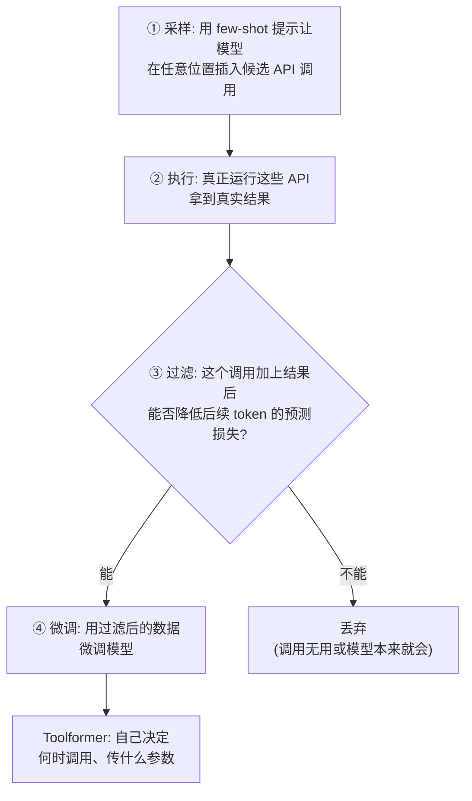

# 精读笔记：Toolformer

> 原文：[Toolformer_2302.04761.pdf](../Toolformer_2302.04761.pdf)（2023，Meta AI）
> **选读论文。读摘要 + 图 1 + 第 2 节（方法四步）即可，约 20 分钟。**

## 0. 一句话总结

> **模型可以自己教自己用工具：采样大量候选工具调用，只保留"真能降低预测难度"的那些，再用这些数据微调——全程不需要人工标注。**

## 1. 它解决什么问题

一个悖论（原文开篇就点出）：LLM 规模越大越聪明，却在**算术、日期、事实查询**这些小学水平的任务上翻车——而计算器、日历、搜索引擎这些几块钱的工具能轻松解决。人类文明的做法是"用工具补短板"，LLM 也该如此。

但当时给模型接工具有两个障碍：要么需要**大量人工标注**（教模型什么时候调什么），要么只能**任务专用**（无法泛化）。Toolformer 要做到：自监督 + 通用。

## 2. 方法拆解（核心四步，值得精读）

以 GPT-J 6.7B 为底座，五个工具：计算器、QA 系统、搜索引擎、翻译、日历。

**第③步是全文的灵魂**。举个例子：文本里出现 "1400 人中 400 人通过"，如果插入 `[Calculator(400/1400) → 0.29]` 后模型预测后续 "29%" 的损失大幅下降，说明这个调用**真的有用**；如果模型本来就会算，损失没变化，就丢弃。**用预测损失的变化作为"工具有用"的客观判据**——不需要任何人来标注"这里该调计算器"。

## 3. 关键结果

- 加了工具的 6.7B 小模型，零样本表现**追平甚至超过大它几十倍的 GPT-3 (175B)**（在算术、QA、日期类任务上）
- LAMA 知识探测任务大幅提升（能查 Wikipedia 了）
- 语言能力**不降级**：模型学会了只在需要时插调用，没把所有文本都塞满 API

## 4. 批判性视角

1. **不是 Agent**：Toolformer 是"单次插入"——在一段文本里见缝插针调 API，没有多轮循环、没有目标驱动。它证明了"模型能学会何时调用"，真正的循环要等 ReAct 这类工作把它变成系统架构
2. **过滤判据的盲区**：损失下降 ≠ 答案正确（模型可能学会了抄答案格式的捷径）；对推理链式任务无能为力
3. **历史地位**：它和 ReAct（同期）从两个方向回答了同一个问题——ReAct 解决"怎么组织循环"，Toolformer 解决"怎么学会用工具"。今天的 Function Calling 训练范式就是两者思路的工业化合体

## 5. 对写 Agent 的启发

1. **数据视角看工具**：给 Agent 加工具时，问自己"这个工具的结果真的能降低模型的预测难度吗？"——一个结果格式混乱、模型用不上的工具，加了也是白加（甚至会帮倒忙）
2. 训练自己 Agent 用的模型时，Toolformer 的"执行 + 损失过滤"是构造工具调用训练数据的标准套路

## 6. 自测

1. Toolformer 如何在不人工标注的情况下判断"这个 API 调用该保留"？
2. 为什么说 Toolformer 不是 Agent？它和 ReAct 各自回答了什么问题？
3. "加了工具的小模型追平大模型"——这个结论对你的模型选型（阶段二）有什么实际意义？
