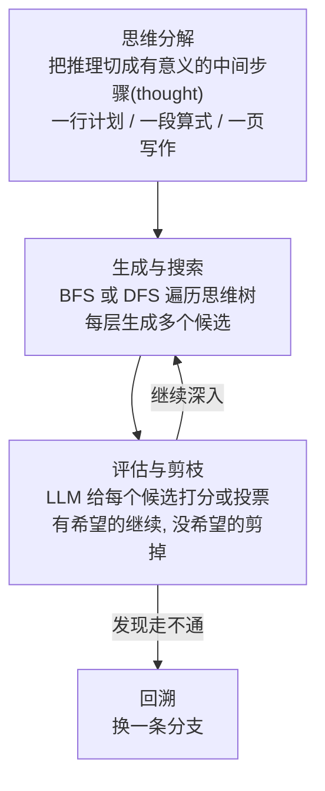

# 精读笔记：Tree of Thoughts (ToT)

> 原文：[Tree_of_Thoughts_2305.10601.pdf](../Tree_of_Thoughts_2305.10601.pdf)（NeurIPS 2023，Princeton + Google DeepMind）
> **选读论文。读摘要 + 图 1（四种范式对比）+ 第 2 节即可。理解思想优先，工程上很少直接用。**

## 0. 一句话总结

> **推理不必从左到右一条道走到黑：把中间推理步骤("thought")变成树上的节点，让模型同时探索多条路径、自我评估打分、该回头就回头——给 LLM 装上"系统 2"式的深思熟虑。**

## 1. 它解决什么问题

LLM 的生成机制是**逐 token、从左到右**的——原文称之为"System 1"（快、自动、不回头）。这对需要**探索、前瞻、回溯**的任务是硬伤：第一步选错了，后面就全错，CoT 只能一条道错到底。

认知科学的"双过程"理论给了启发：人还有 System 2（慢、深思、可回溯）。ToT 就是要给 LLM 补上这个。

## 2. 方法拆解

三个组件拼成一台"推理搜索引擎"：

和前作 ReAct 的关系：ReAct 是**线性**的 Thought→Action→Observation（单路径）；ToT 是**树状**的 Thought→多个候选 Thought（多路径 + 回溯）。同一个"thought"概念，从链升级成了树。

## 3. 关键结果

- **Game of 24（24 点）**：GPT-4 用 CoT 只解出 **4%**，ToT 解出 **74%**——18 倍差距，而任务本身对一个会"试错回溯"的人类小学生不难。这个数字是"系统 1 vs 系统 2"差距的最直观展示
- 创意写作（连贯性提升）、迷你填字（可完整求解 5x5 谜题）也有显著提升
- 代价：单任务消耗的调用次数是 CoT 的**几十倍**——用算力换搜索

## 4. 批判性视角（为什么"了解即可"）

1. **成本极高**：树搜索 × LLM 打分，每个任务几十上百次调用。生产中很少直接照搬
2. **被 Agent 吸收了**：真实世界里，"探索 + 回溯"更多是由 Agent 循环 + 工具（把状态存文件、重开一轮）实现的，而不是在同一轮推理里做树搜索
3. **但思想到处都是**：你会在各处遇到它的变体——Orchestrator 拆解任务时的多方案选择、搜索 Agent 的"换关键词重搜"、Planner-Executor 架构里 Planner 的重规划，本质上都是"在决策点保留多个选项并评估"
4. 评估打分那一步就是 **LLM-as-judge** 的早期形态（阶段三会专门学）

## 5. 对写 Agent 的启发

1. **"候选生成 + 自我评估 + 剪枝"可以按需局部使用**：不用整棵树，只在关键决策点（比如"选哪个技术方案"）让模型列出 3 个候选并互相评估，性价比很高
2. 检索/搜索类 Agent 的提示词里，明确允许"回溯"（"如果当前方向 3 次都没有进展，换一个搜索词"）——这是把 ToT 的回溯思想降维成一句规则
3. 判断要不要用它：任务是否"一步定生死"？如果中间错了能低成本重来，用 Agent 循环就够；如果错一步全盘皆输（如规划类），才值得上显式搜索

## 6. 自测

1. CoT 和 ToT 在"推理路径"上的本质区别是什么？
2. 24 点任务 4% → 74% 的差距说明了 LLM 原生机制的什么缺陷？
3. 为什么生产环境很少直接用 ToT？它的思想以什么形式活在现代 Agent 里？
