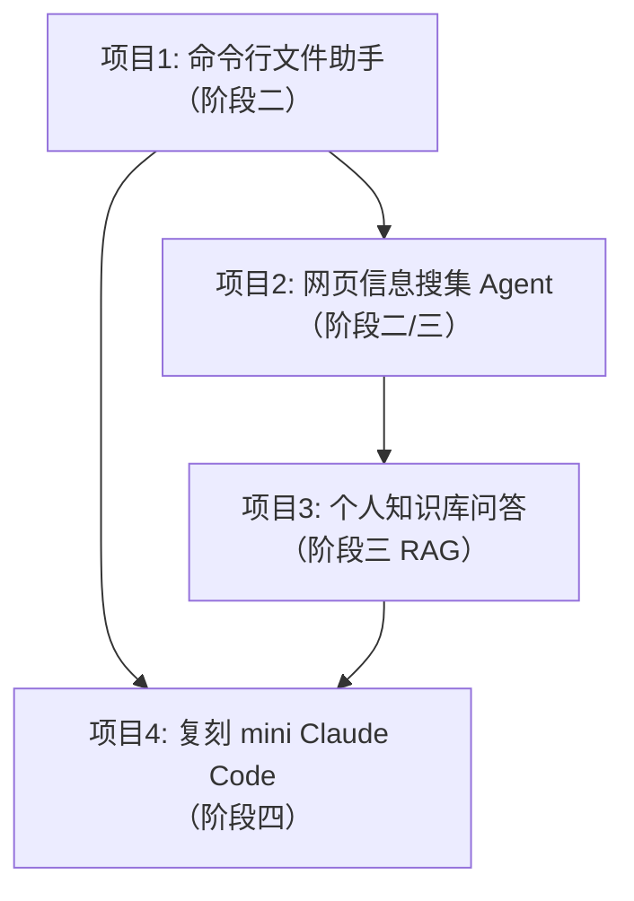
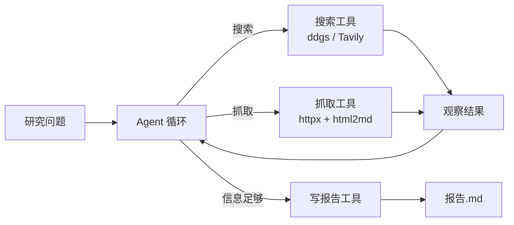
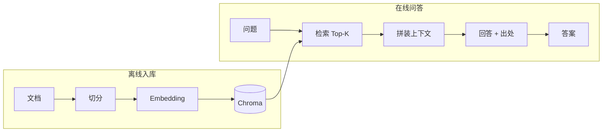
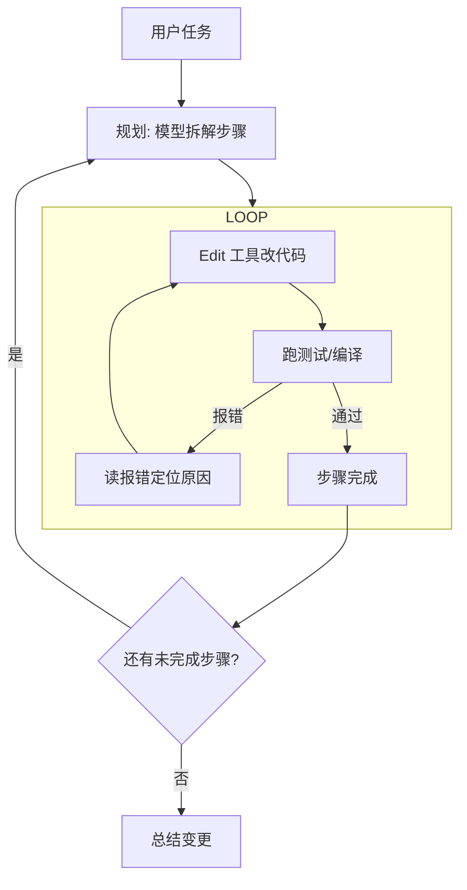

# 实战项目

> 边学边做，由易到难。每个项目都对应学习路线的某个阶段，做完一个勾一个。
> 建议每个项目一个子目录：`projects/p1-cli-assistant/` 这样命名。

## 项目总览

---

## 项目 1：命令行文件助手

**对应阶段**：二 | **预计耗时**：2~3 天 | **难度**：★☆☆☆☆

### 需求

一个终端里可对话的助手，能操作当前目录的文件：

- 列出文件、读取文件内容、写入/修改文件、创建目录
- 接受自然语言指令，如"把这些 md 文件的标题汇总成一个 README"
- 危险操作（删除、覆盖非空文件）前必须让用户确认

### 要设计的工具

| 工具 | 说明 |
|------|------|
| `list_dir(path)` | 列目录内容 |
| `read_file(path)` | 读文件（注意长文件截断策略） |
| `write_file(path, content)` | 写文件（要防止越权写上级目录） |
| `run_command(cmd)` | 执行 shell 命令（白名单 + 确认机制） |

### 关键学习点

- 路径安全：模型可能写出 `../../etc/xxx`，要做路径白名单校验
- 危险操作的人工确认：human-in-the-loop 最简单的实现
- `run_command` 输出可能极长——这是你第一次真正遇到**上下文爆炸**问题

### 完成标准

能连续完成一个 3 步以上的文件任务（如"找到最大的三个文件，把它们的路径写进 summary.txt"），全程无需人工干预（除危险操作确认）。

---

## 项目 2：网页信息搜集 Agent

**对应阶段**：二 → 三 | **预计耗时**：3~5 天 | **难度**：★★☆☆☆

### 需求

给一个研究问题，Agent 自主搜索、抓取网页、交叉验证、汇总成结构化报告（Markdown）。例如："调研 2026 年主流 Agent 框架的对比，输出带来源的报告"。

### 架构

### 关键学习点

- 任务分解：模型能否把一个大问题拆成多个搜索查询？
- 信息冲突时怎么办（两个来源说法不一致）——提示词里要有处理策略
- 控制成本：设置最大搜索/抓取次数上限

### 完成标准

产出一份带引用来源的报告，且换 3 个不同主题都能跑通。

---

## 项目 3：个人知识库问答

**对应阶段**：三 | **预计耗时**：1 周 | **难度**：★★★☆☆

### 需求

把你自己的笔记/文档（md、pdf）变成可问答的知识库：

1. 文档入库：切分 → Embedding → 存入向量库（Chroma）
2. 问答时：检索 Top-K 片段注入上下文，模型基于片段回答并**标注出处**
3. 处理"知识库里没有答案"的情况（拒答而不是编造）

### 流水线

### 关键学习点

- Chunk 大小的权衡：太小丢上下文，太大稀释信息
- 检索质量差时的兜底（关键词检索混合、重排序）
- 引用出处（citation）如何设计

### 完成标准

问 10 个问题，8 个以上答案正确且引用了正确的来源段落；对库里没有的问题能正确拒答。

---

## 项目 4：复刻 mini Claude Code（毕业项目）

**对应阶段**：四 | **预计耗时**：2~3 周 | **难度**：★★★★☆

### 需求

做一个能在终端里理解和修改代码库的 Agent：

- 能探索代码库（grep / 读文件 / 看目录结构）
- 能理解任务并制定多步计划
- 能修改代码 → 跑测试 → **根据报错自我修正**（这是灵魂）
- 能把多轮工作过程持久化，支持断点续跑

### 架构草图

### 关键学习点（都是工业界真实难题）

- **探索效率**：如何设计 grep/read 工具让模型用最少的轮次定位代码
- **自我修正循环**：报错信息如何截断/精简后喂回模型
- **上下文持久化**：长任务压缩历史后不丢失关键信息
- **ACI 设计**：把阶段四读到的 Agent-Computer Interface 理论用起来

### 完成标准

给它一个真实的小 bug（比如自己开源练手项目里的 issue），能自主定位并修复，测试通过。

---

## 通用要求（每个项目都要做）

1. **写一个 `NOTES.md`**：踩了什么坑、为什么、怎么解决——这是最值钱的产出
2. **打印 token 消耗和轮数**：养成成本意识
3. **至少 10 个测试用例**：阶段三学的评测，从项目 2 开始就要用起来
4. **用 Git 管理每个项目**：改提示词前后要有 diff 可以对比
