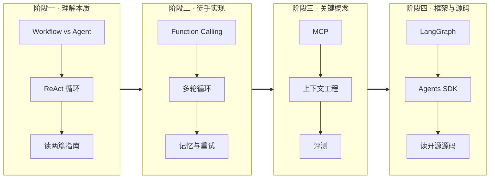
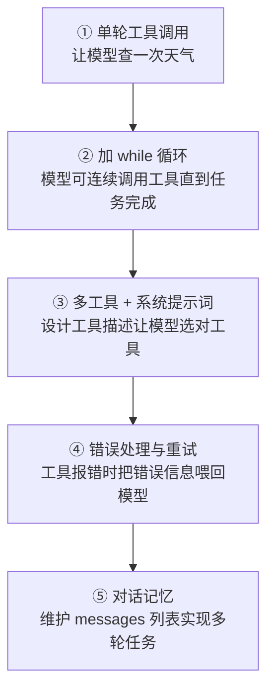
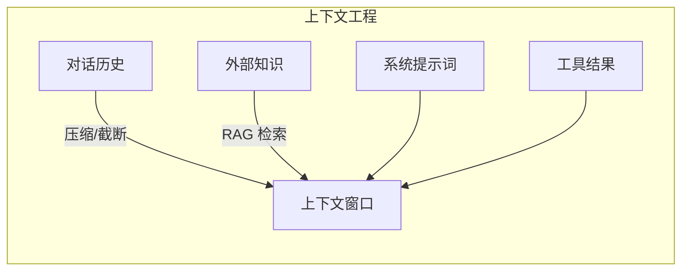
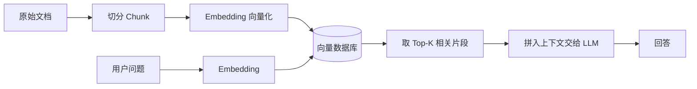
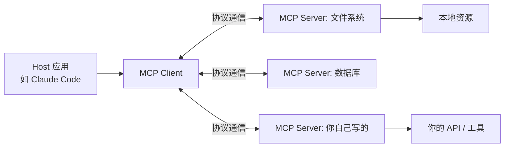

# Agent 学习路线

> 预计总时长 6~9 周（业余时间），可按基础快进或跳过。
> 核心方法：**用中学**——每学一个概念，立刻动手验证它。

## 总览

---

## 阶段一：理解本质（1~2 周）

**目标**：建立正确的心智模型。Agent = 在循环中使用工具的 LLM。

要搞清楚的问题：

1. **Workflow 和 Agent 的区别是什么？**
   - Workflow：开发者预先编排好代码执行路径，LLM 只是其中的环节（可控、便宜、可预测）
   - Agent：LLM 自己决定下一步做什么、用哪个工具、何时结束（灵活、贵、不可预测）
   - **关键结论：能用 Workflow 解决的问题不要上 Agent**
2. **ReAct 循环是什么？** 模型交替进行「思考（Reason）→ 行动（Act）→ 观察（Observe）」
3. **工具调用（Function Calling）的底层机制是什么？** 并不是模型真的"执行"了函数——模型只是输出一段结构化的 JSON 表达意图，由你的代码负责执行并把结果喂回去

详见 [01-fundamentals/README.md](01-fundamentals/README.md)

**必读资料**：
- Anthropic《Building Effective Agents》
- OpenAI《A Practical Guide to Building Agents》
- ReAct 论文（arXiv: 2210.03629）

**验收标准**：能用自己的话向别人解释清楚"Agent 循环"和"为什么不需要框架也能写出 Agent"。

---

## 阶段二：徒手写一个最小 Agent（1~2 周）⭐ 最重要

**目标**：不借助任何框架，只用 LLM API 手写一个能用的 Agent。这一步的价值在于彻底理解框架帮你封装了什么。

动手清单（循序渐进）：

三个关键的实战经验（都会在做题过程中踩到）：

1. **工具描述比模型聪明更重要**——模型选工具几乎完全依赖工具的 name / description / 参数说明
2. **错误也是信息**——工具执行失败时，把报错文本喂回模型，模型经常能自己修正
3. **必须有终止条件**——最大循环轮数、明确的"任务完成"信号，否则会烧钱死循环

详见 [02-hands-on/README.md](02-hands-on/README.md)（含参考代码骨架）

**验收标准**：不看教程，从空文件开始 30 分钟内写出一个可用的工具调用循环。

---

## 阶段三：补齐关键概念（2~3 周）

**目标**：掌握把玩具 Agent 变成可用产品所需的三块能力。

| 概念 | 要解决的问题 | 学习重点 |
|------|------------|---------|
| MCP | 工具接入的标准化 | 为什么需要统一协议、Server/Client 架构、写一个自己的 MCP Server |
| 上下文工程 | 有限窗口内塞进最有用信息 | 历史压缩、检索注入（RAG）、系统提示词分层 |
| 评测 | "感觉不错" → 可量化 | 任务成功率、轨迹评估、LLM-as-judge |

RAG 的基本流水线：

MCP 的架构：

详见 [03-concepts/README.md](03-concepts/README.md)

**验收标准**：写出一个自己的 MCP Server 并在客户端里用起来；能说出自己项目的评测方案。

---

## 阶段四：框架原理与源码阅读（2 周）

**目标**：带着阶段二的理解去看框架，重点看"它把哪些东西抽象掉了"。

1. **LangGraph**：看它的状态图（StateGraph）和 checkpoint 机制——本质是把 Agent 循环显式建模成图
2. **OpenAI Agents SDK**：看它的 handoff（Agent 间交接）和 guardrails 设计
3. **读开源 Agent 源码**（选一个深入）：
   - [OpenHands](https://github.com/All-Hands-AI/OpenHands)：通用软件工程 Agent
   - [SWE-agent](https://github.com/SWE-agent/SWE-agent)： Princeton 的 SWE Agent，论文值得一读
   - [12-factor agents](https://github.com/humanlayer/12-factor-agents)：12 条构建可靠 Agent 的工程原则，强烈推荐

**验收标准**：能用阶段二的手写版复现某个框架的核心特性（比如子 Agent 委派）。

---

## 实战项目（贯穿全程）

详见 [projects/README.md](projects/README.md)。由易到难：

1. **命令行文件助手**——能读写本地文件的 Agent（简化版 Claude Code）
2. **网页信息搜集 Agent**——搜索 + 抓取 + 汇总成报告
3. **个人知识库问答**——加 RAG 的文档问答
4. **复刻 mini Claude Code**——理解任务、改代码、跑测试、根据报错自我修正

---

## 推荐的学习习惯

- **每天用 Agent 工具干活**（比如 ZCode），遇到它的行为就去想"内部是怎么实现的"，然后验证
- **建一个"坑本"**：把自己踩的坑（模型选错工具、循环不终止、上下文爆了……）记下来，这些就是面试和实战中最值钱的经验
- **不要收集资料上瘾**：资料够用就开写，写不下去再回来查
